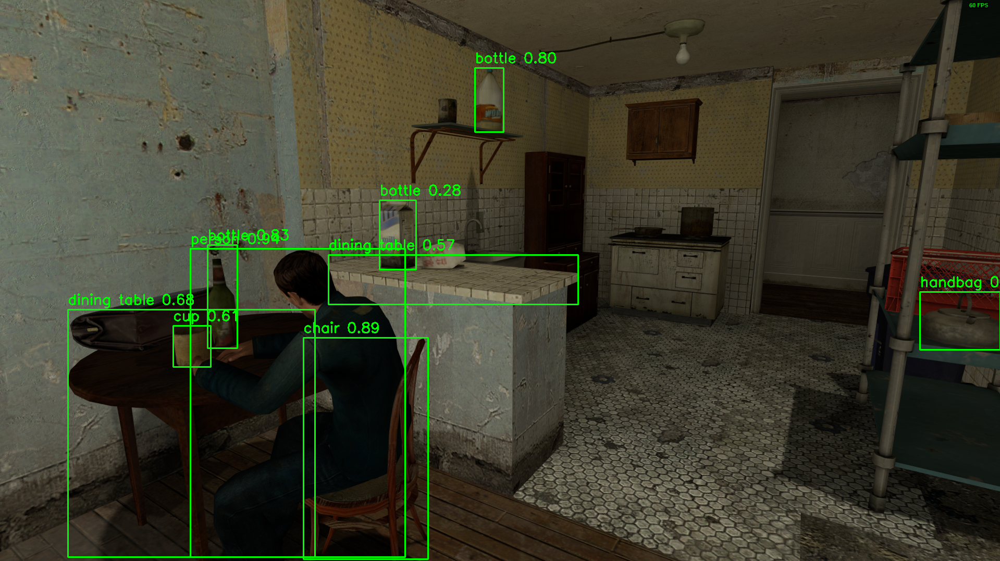

# YOLO Object Recognition in Video Games

This repository contains scripts for performing object recognition in video games using YOLO (You Only Look Once) models. Two main scripts are included: one using YOLOv5 and the other using YOLOv8. These scripts capture the screen, run object detection, and display the results in real-time.

## Scripts

### 1. `yolov5_object_recognition.py`

This script uses the YOLOv5 model for object detection.

#### Features
- Real-time object detection on a specified region of the screen.
- Displays detected objects with bounding boxes and labels.

#### Usage
1. Ensure you have Python 3.6+ installed.
2. Install the required libraries using:
    ```sh
    pip install opencv-python-headless torch pillow
    ```
3. Download the YOLOv5 model weights and place them in the same directory as the script.
4. Run the script to start the object detection.

### 2. `yolo_version_8.py`

This script uses the YOLOv8 model for object detection.

#### Features
- Real-time object detection on a specified region of the screen.
- Displays detected objects with bounding boxes and labels.
- Automatically places the display window on the second monitor if available.

#### Usage
1. Ensure you have Python 3.6+ installed.
2. Install the required libraries using:
    ```sh
    pip install opencv-python-headless pillow screeninfo ultralytics
    ```
3. Download the YOLOv8 model weights and place them in the same directory as the script.
4. Run the script to start the object detection.

## Demonstration

Below is an image demonstrating the YOLOv8 object recognition in action:



## Notes
- Ensure you have the required model weights in the same directory as the scripts.
- Adjust the screen region and other parameters as needed.
- Ensure your environment has the necessary dependencies installed.
